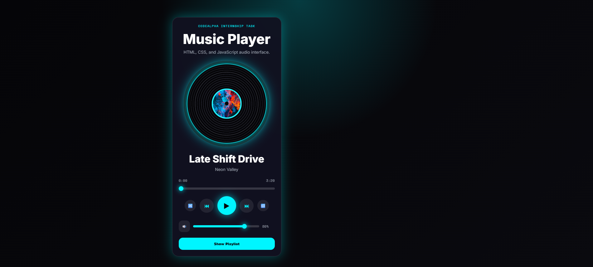

# 🎵 CodeAlpha Music Player

A modern Music Player built using **HTML, CSS, and JavaScript** as part of the **CodeAlpha Frontend Development Internship**.

The application provides a complete music playback experience with playlist management, autoplay, shuffle, repeat modes, volume controls, a clickable progress bar, and a rotating vinyl record interface.

---

## 🚀 Live Demo

https://fazal305.github.io/CodeAlpha_MusicPlayer/

---

## 📸 Screenshot



```text
assets/screenshots/music-player-preview.png
```

---

## ✨ Features

### Music Controls

* Play Song
* Pause Song
* Previous Track
* Next Track

### Progress Controls

* Live Progress Bar
* Click To Seek
* Drag To Seek
* Current Time Display
* Total Duration Display

### Volume Controls

* Volume Slider
* Mute / Unmute
* Volume Percentage
* Saved Volume Using Local Storage

### Playlist

* Playlist Panel
* Click Any Song To Play
* Active Song Highlight
* Animated Equalizer Indicator

### Playback Modes

* Shuffle Mode
* Repeat All
* Repeat One
* Autoplay Next Track

### Visual Features

* Rotating Vinyl Record
* Album Artwork Printed On Vinyl Center
* Dynamic Accent Colors Per Track
* Neon Glow Effects
* Mobile Responsive Layout

---

## 🛠️ Technologies Used

* HTML5
* CSS3
* JavaScript (Vanilla JS)
* HTML5 Audio API
* Local Storage

---

## 📁 Project Structure

```text
CodeAlpha_MusicPlayer
│
├── index.html
├── player-styles.css
├── player-script.js
├── README.md
├── LICENSE
├── .gitignore
│
└── assets
    ├── audio
    │   ├── track-01.mp3
    │   ├── track-02.mp3
    │   ├── track-03.mp3
    │   ├── track-04.mp3
    │   └── track-05.mp3
    │
    └── covers
        ├── cover-01.jpg
        ├── cover-02.jpg
        ├── cover-03.jpg
        ├── cover-04.jpg
        └── cover-05.jpg
```

---

## 🎯 Internship Requirements Covered

✔ Play / Pause

✔ Previous / Next

✔ Song Title

✔ Artist Name

✔ Duration Display

✔ Progress Bar

✔ Volume Control

✔ Playlist

✔ Autoplay

✔ Responsive Interface

---

## ▶️ How To Run

1. Download or clone the repository.

2. Add audio files inside:

```text
assets/audio
```

3. Add cover images inside:

```text
assets/covers
```

4. Open:

```text
index.html
```

in your browser.

---

## 👨‍💻 Developer

**Fazal Abbas**

GitHub:
https://github.com/fazal305

LinkedIn:
https://www.linkedin.com/in/fazal-abbas-4653dg86

---

## 📄 License

This project is licensed under the MIT License.
